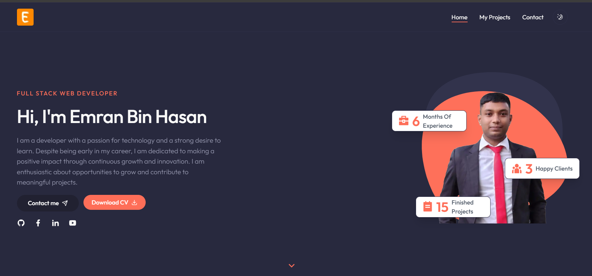

### Project Overview:

**Project Name:** Emran Bin Hasan's Portfolio  
**Description:** This is a personal portfolio built with Next.js, Tailwind CSS, and ShadCN. It showcases my skills as a Full-Stack Web Developer, featuring my work, contact information, and other relevant details in a sleek, modern design.

**Screenshot:**  

---

### Main Technologies:
- **Frontend:** Next.js, Tailwind CSS, ShadCN
- **Backend:** (If applicable, mention the backend stack here, e.g., Node.js, MongoDB)
- **Database:** (If applicable, mention your database, e.g., MongoDB, PostgreSQL)

---

### Main Features:
- Modern and responsive design
- Contact form with validation and submission
- Showcasing projects with live demos and GitHub links
- Dark and light theme support
- Animations using ShadCN
- Smooth scrolling and transitions

---

### Dependencies:
- `@hookform/resolvers`: ^3.9.1
- `@radix-ui/react-dialog`: ^1.1.4
- `@radix-ui/react-icons`: ^1.3.2
- `@radix-ui/react-label`: ^2.1.1
- `@radix-ui/react-slot`: ^1.1.1
- `@radix-ui/react-tabs`: ^1.1.2
- `class-variance-authority`: ^0.7.1
- `clsx`: ^2.1.1
- `emailjs-com`: ^3.2.0
- `framer-motion`: ^11.15.0
- `lucide-react`: ^0.469.0
- `next`: 15.1.3
- `next-themes`: ^0.4.4
- `react`: ^19.0.0
- `react-countup`: ^6.5.3
- `react-dom`: ^19.0.0
- `react-hook-form`: ^7.54.2
- `react-icons`: ^5.4.0
- `shadcn-ui`: ^0.9.4
- `swiper`: ^11.2.0
- `tailwind-merge`: ^2.6.0
- `tailwindcss-animate`: ^1.0.7
- `zod`: ^3.24.1

---
## Local Setup Guide:

### 1. Clone the repository:
Clone the project repository to your local machine by running the following command in your terminal:

git clone https://github.com/emran-binhasan/dev-emran.git

### 2. Navigate to the project directory:
Once the repository is cloned, navigate into the project folder:

cd <your-project-folder>

### 3. Install dependencies:
Install all the necessary dependencies for the project by running:

npm install

### 5. Run the local development server:
After installing the dependencies and setting up any environment variables, start the local development server by running:

npm run dev

By default, the project will be available at `http://localhost:3000`.

---

## Live Link:
Once the setup is complete and everything is running locally, you can view your project live at:

[https://dev-emran.vercel.app](https://dev-emran.vercel.app)

